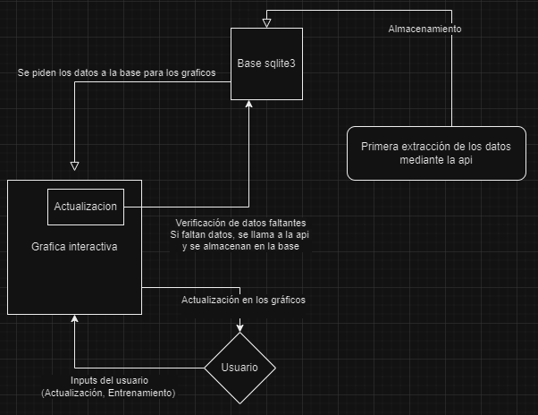
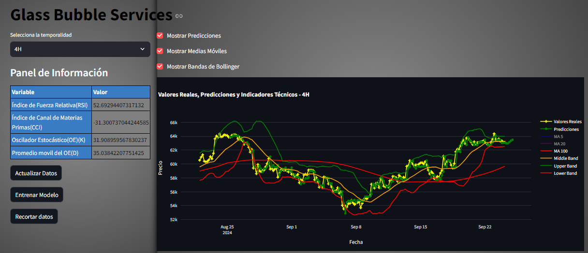

# Glass Bubble

### Glass Bubble se destaca en el mercado por ofrecer servicios de monitoreo y seguimiento de modelos de ML y DP.

### Tabla de contenidos

1. [Contexto](#contexto)
2. [Instalacion y requisitos](#instalacion-y-requisitos)
3. [Diagrama de Flujo](#diagrama-de-flujo)
4. [Entregables](#entregables)
5. [Data Engineering](#data-engineering)
6. [Data Analysis](#data-analysis)
6. [Data Science](#data-science)
6. [Autor](#autor)

## Contexto
#### Bull Market Broker(BMB) llego a la conclusion de que la adaptacion de su plataforma para incluir criptomonedas era algo por concluir.

Bull Market Broker busca expandir su base de usuarios y capitalizar el creciente interés en las criptomonedas. Al incorporar criptomonedas a su plataforma, BMB apunta a atraer a un público más joven y tecnológicamente avanzado, que busca invertir en activos digitales con alto potencial de crecimiento.

El público objetivo de BMB son principalmente traders activos y entusiastas de las criptomonedas con conocimientos básicos de análisis técnico. Estos usuarios buscan herramientas que les permitan realizar un seguimiento en tiempo real de los precios, identificar patrones y tomar decisiones de inversión informadas.

#### Bitcoin ha sido seleccionado como el principal activo debido a su alta liquidez, reconocimiento de marca y madurez en comparación con otras criptomonedas. Además, Bitcoin es ampliamente considerado como el "oro digital" y sirve como una referencia para el resto del mercado de criptomonedas.

#### El objetivo del cliente es un tablero interactivo con un panel donde se encuentren las variables que considere mas importantes a la hora de evaluar la serie.
#### Por lo que, el alcance del proyecto se extendera solamente hasta bitcoin con 4 temporalidades:

- 1 dia 
- 4 horas
- 1 hora
- 5 min.

Se consideraran otras mejoras del tablero en la seccion de Upgrades.

## Instalacion y requisitos

- Python()
- Sql(sqlite3)
#### Librerias de Python
Manipulacion:
- Pandas()
- Numpy()
- pyarrow()
- sqlite()

Visualizacion:
- Matplolib()
- Seaborn()

Modelo de Machine Learning
- Sklearn()
- ForecasterAutoreg()
- LGBMRegresor()

## Diagrama de flujo

## Entregables

**Tablero interactivo**

El tablero se realizara usando Streamlit, una libreria de python.

**Componentes**:
- 4 Graficas(24h,4h,1h,5m) interactivas con valor real y prediccion futura.
- Botonera:

- a) boton actualizar: Al ejecutarse, se realizara una llamada a la api para la extraccion
de los datos faltantes, se transformaran y cargaran en una base de datos local de sqlite3.
- b) boton reentrenar: Al ejecutarse, se entrenara un modelo de machine learning sobre
los ultimos datos del dataframe y se actualizaran las predicciones sobre los datos
en tiempo real.
- c) boton cortar: Al ejecutarse, se reduciran los datos cargados en la base sql, con el fin
de no almacenar datos mas antiguos de lo que el modelo requiere.

- Panel: panel con valores de las variables que describen diferentes caracteristicas del activo en ese momento especifico, pudiendo ser alternado entre los 4 marcos temporales que tienen los graficos.

### Interaccion del usuario

El usuario atravez del tablero puede ejecutar 4 acciones:

- Actualizar la base de datos, al ejecutarse, se realizara una llamada a la api para la extraccion de los datos faltantes, se transformaran y almacenaran en la base de datos.

- Reentrenar modelo, al ejecutarse se volvera a entrenar el modelo con los ultimos datos y generar predicciones en tiempo real.

- Recortar, al ejecutarse, se reduciran los datos cargados en la base de datos con el fin de no almacenar datos mas antiguos de lo que el modelo requiere.

- Eleccion del marco temporal del tablero.

El tablero incluye un panel interactivo que permite a los usuarios explorar los datos del activo en diferentes escalas temporales. Al seleccionar un marco temporal determinado (1 día, 4 horas, 1 hora o 5 minutos), el panel se actualizará automáticamente para mostrar los indicadores más importantes calculados sobre los datos de ese período.

### Variables Sinteticas: Panel de informacion y variables para el grafico

#### 1. Promedio Móvil (Moving Average, MA)
* **Concepto:** Es un indicador que suaviza los datos de precios al calcular el promedio del precio de cierre durante un período específico.
* **Tipos:**
  * **Corto plazo:** Refleja tendencias más recientes del precio.
  * **Largo plazo:** Muestra la tendencia general del precio a largo plazo.
* **Uso:** Se utiliza para identificar tendencias alcistas (precio por encima del MA) o bajistas (precio por debajo del MA).
- En el grafico interactivo se presentan como medias.

#### 2. Bandas de Bollinger
* **Concepto:** Miden la volatilidad del precio en relación a un promedio móvil.
* **Componentes:**
  * **Media móvil:** Promedio del precio de cierre durante un período específico.
  * **Banda superior:** Media móvil más dos desviaciones estándar.
  * **Banda inferior:** Media móvil menos dos desviaciones estándar.
* **Uso:** Cuando el precio toca las bandas, puede indicar sobrecompra (banda superior) o sobreventa (banda inferior).
- bandas en el grafico interactivo.

#### 3. Oscilador Estocástico
* **Concepto:** Mide el precio de cierre en relación al rango de precios de un período determinado.
* **Componentes:**
  * **%K:** Porcentaje que indica la posición del precio de cierre en relación al rango de precios.
  * **%D:** Promedio móvil del %K.
* **Uso:** Señales de sobrecompra cuando %K y %D están por encima de un nivel determinado (generalmente 80) y de sobreventa cuando están por debajo de otro nivel (generalmente 20).

#### 4. Índice de Fuerza Relativa (RSI)
* **Concepto:** Mide la velocidad y el cambio de los precios.
* **Uso:** Señales de sobrecompra cuando el RSI está por encima de un nivel determinado (generalmente 70) y de sobreventa cuando está por debajo de otro nivel (generalmente 30).

#### 5. Índice de Canal de Materias Primas (CCI)
* **Concepto:** Mide la desviación del precio en relación a un promedio móvil.
* **Uso:** Señales de sobrecompra cuando el CCI está por encima de un nivel determinado (generalmente 100) y de sobreventa cuando está por debajo de otro nivel (generalmente -100).

**Nota:** Estos indicadores son herramientas de análisis técnico y no garantizan resultados futuros. Es importante utilizarlos en combinación con otros análisis y considerar el contexto del mercado.

## Data Engineering
### :hammer: ETL :wrench:

Se comenzo utilizando un dataset con los valores diarios del bitcoin.

Para los datos de 4 horas, 1 hora y 5 minutos, se extrayeron utilizando la api de cctx la cual se encarga de realizar las llamadas a las api, donde se modifican los parametros para extraer los datos correctos.

### Funcion de actualizacion: Actualizacion y carga incremental de la data.

Esta función actualiza los datos de velas diarias (1d,4h,1h y 5min) de Bitcoin, obteniendo información desde un exchange y almacenándola en una base de datos SQLite.

- El parámetro **since** se utiliza para especificar desde qué fecha se extraen los datos históricos. Este valor se calcula a partir de la fecha más reciente (date_old) en la base de datos, transformándola en un timestamp en milisegundos.
El parametro since, cuando realizamo la primera extraccion de los datos, le restamos valores(correspondientes a la cantidad de datos extraidos por llamada) para poder ir extrayendo datos cada vez mas antiguos, hasta conseguir todos los datos historicos que necesitemos.

- **Verificación y almacenamiento**: Se verifica si los datos obtenidos ya existen en la base de datos, comparando las fechas (time) y añadiendo únicamente los datos faltantes.

- **Ciclo de actualización**: Mientras haya más de X minutos de diferencia (equivalente a la diferencia entre un registro y otro. 1d=1440min,1h=60min,etc) entre la última fecha de la base de datos y la fecha actual, el ciclo sigue obteniendo y almacenando datos. Cada vez que se obtiene un lote de datos, se actualiza el parámetro since sumando el valor de un año.

## Data Analysis
Antes de analizar una serie temporal, es importante tener en cuenta algunos conceptos, uno de ellos es la autocorrelacion.

La **autocorrelación** mide el grado de similitud entre una serie temporal y una versión desplazada de ella misma (lag). Básicamente, evalúa si los valores anteriores de la serie tienen alguna relación con los valores futuros. Si la autocorrelación es alta, significa que la serie tiene un patrón repetitivo o tendencial; si es baja o negativa, los valores son más independientes entre sí.

### :chart_with_upwards_trend: Autocorrelacion :chart_with_downwards_trend:

Los gráficos de autocorrelación indican que el lag 1 es el único que está correlacionado con el lag 0. Los siguientes lags no superan el umbral de significancia.

El gráfico muestra una disminución progresiva de la autocorrelación conforme aumenta el número de lags. El primer lag parece estar correlacionado fuertemente con el lag 0 (es decir, el valor inmediato anterior), lo que indica que la serie temporal es fuertemente dependiente del valor inmediatamente anterior.

En series temporales financieras como Bitcoin, es común que el valor del periodo inmediatamente anterior (lag 1) sea altamente predictivo del valor actual debido a la inercia o persistencia de los precios.

Esto se debe a la naturaleza persistente de los mercados financieros, donde los precios tienden a seguir una tendencia o continuar el mismo comportamiento en cortos periodos de tiempo. En este caso, los valores anteriores influyen en los futuros de forma más inmediata.

**Preparación y análisis de datos**
- Frecuencia de los datos: Se utilizaron datos en intervalos de 4 horas para capturar movimientos de precios más granulares.
- Distribución de precios: la mayoría de los precios de Bitcoin están por debajo de los 20 000 USD, en particular en el período comprendido entre 2013 y septiembre de 2020. Sin embargo, desde 2021, los precios han sido significativamente más altos, oscilando entre 35 000 USD y 67 500 USD.

**Desafíos y estrategias de modelado**
- Distribución asimétrica y diferentes órdenes de magnitud: modelar series temporales con estas características puede ser complejo.
- Modelado de deltas: se consideraria utilizar deltas (cambios en el precio) en lugar de valores directos puede simplificar el modelado al reducir el impacto de la distribución asimétrica y la alta volatilidad.

## Data Science

Cabe destacar que el precio del Bitcoin es altamente volátil debido a:
- Su naturaleza descentralizada: Sin un banco central que controle la oferta, el mercado es más susceptible a cambios bruscos.
- Factores externos impredecibles: Noticias, regulaciones y la psicología de los inversores influyen directamente en el precio.
- Al ser un activo nuevo, los patrones históricos no siempre son confiables para predecir su comportamiento.

Considerando estos factores, se procedio a crear el modelo.

### :crystal_ball: Modelo :crystal_ball:

Se utilizo un forecaster(pronosticador) autoregresivo con LGBMRegressor que utiliza valores pasados de una serie de tiempo para predecir valores futuros. Funciona al entrenar un modelo Light Gradient Boosting Machine (LGBMRegressor) con los valores históricos de la serie. El LGBMRegressor, una técnica de boosting de gradiente, aprende las relaciones entre los valores pasados y crea un modelo que puede extrapolar estas relaciones para realizar predicciones. En esencia, el modelo busca patrones en los datos históricos y utiliza estos patrones para pronosticar cómo evolucionará la serie en el futuro.

Respecto al bloque de ciencia de datos, ¿porque se decidio utilizar este modelo?

Los modelos autoregresivos son especialmente diseñados para predecir valores futuros de una serie temporal basándose en sus valores pasados. Esto consideramos es ideal ya que el precio puede estar fuertemente influenciado por su historial y tiende a seguir ciertos patrones. Ademas de la **flexibilidad** que permiten estos modelos al poder incorporar múltiples variables exogenas que pueden llegar a influir en el precio.

El modelo LGBMRegressor permite trabajar con datos numéricos y categóricos ademas de poder incoporar técnicas para evitar el sobreajuste.

El LightGBM Regressor es un algoritmo de Machine Learning basado en un enfoque de gradient boosting sobre árboles de decisión. Este método construye múltiples árboles secuencialmente, donde cada nuevo árbol corrige los errores del anterior.

Cuando se integra un modelo autoregresivo con LightGBM, los valores rezagados de la serie temporal se utilizan como características (features) en el entrenamiento del modelo. Cada fila del conjunto de entrenamiento contiene los valores pasados de la serie y el valor objetivo (el próximo valor que se desea predecir). De este modo, LightGBM aprende a optimizar la predicción ajustando las interacciones entre los valores rezagados.

### Autor:

<table style="width: 100%; text-align: center; border-collapse: collapse; border-bottom: 1px solid #ccc;">
  <tr>
    <td style="border-right: 1px solid #ccc; border-top: 1px solid #ccc; border-bottom: none; padding: 10px;">
      <strong>Pablo Chamena</strong> (Data Scientist)
    </td>
  </tr>
  <tr>
    <td style="border-right: 1px solid #ccc; border-top: none; padding: 10px;">
      
    </td>
  </tr>
</table>

- Linkedin: https://www.linkedin.com/in/pablo-chamena-8814bb211/
- Video: https://www.youtube.com/watch?v=MLEL1mL19vg&t=7s
